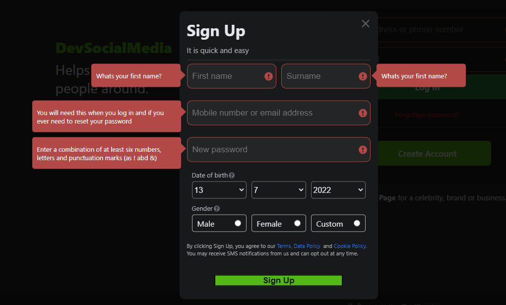
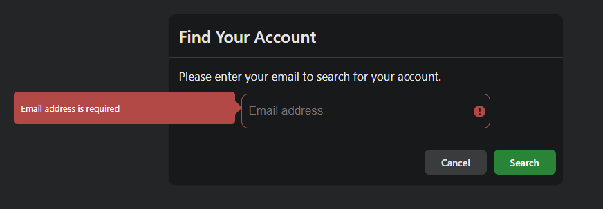
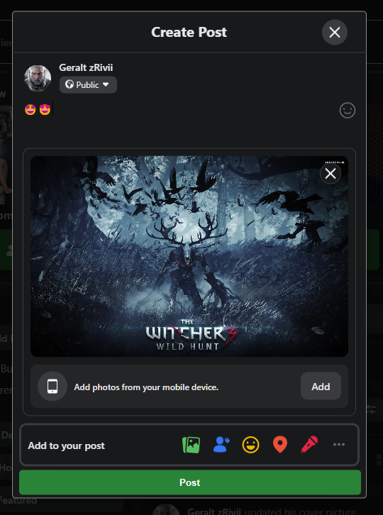
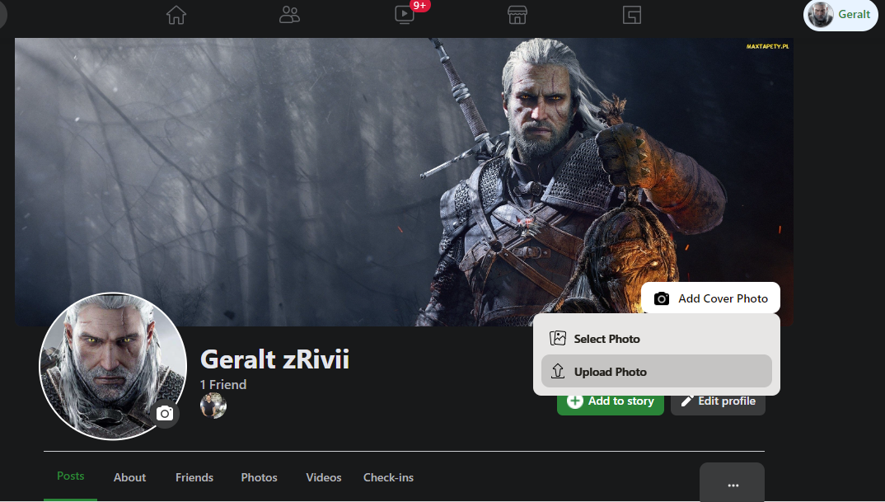
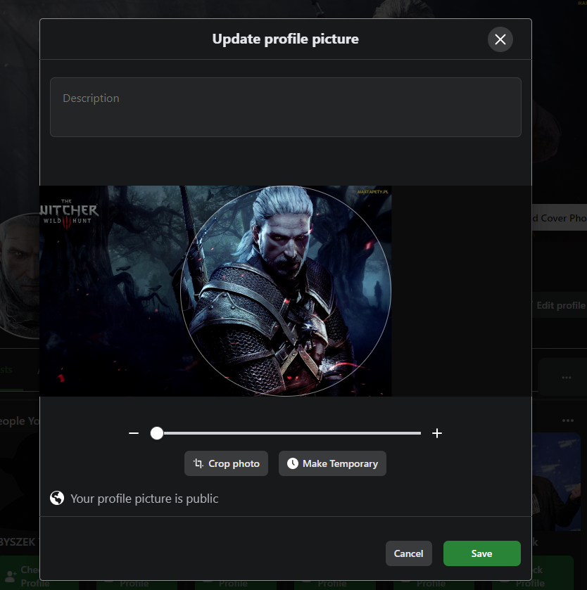
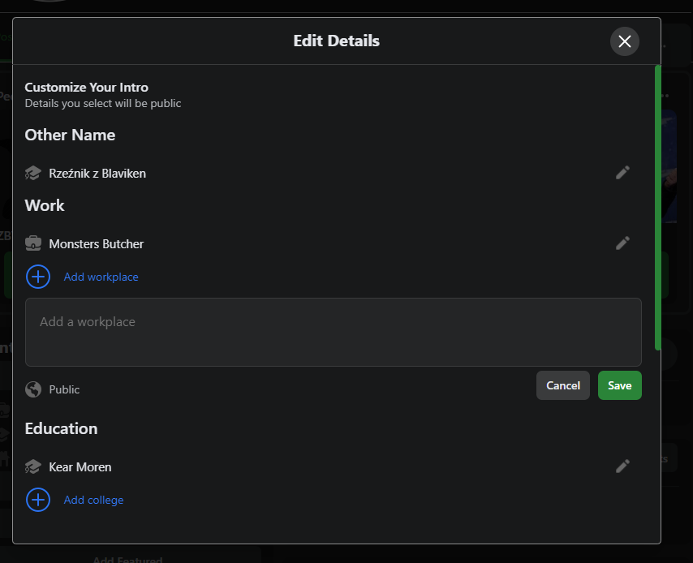
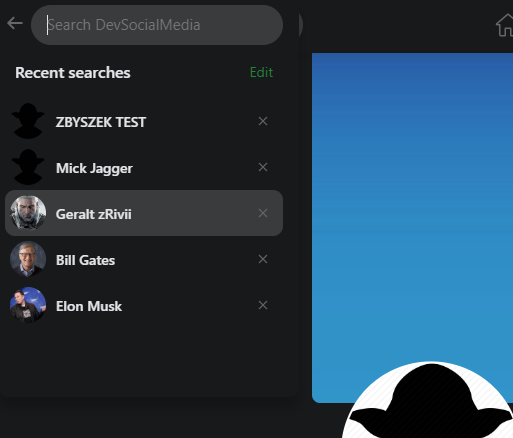
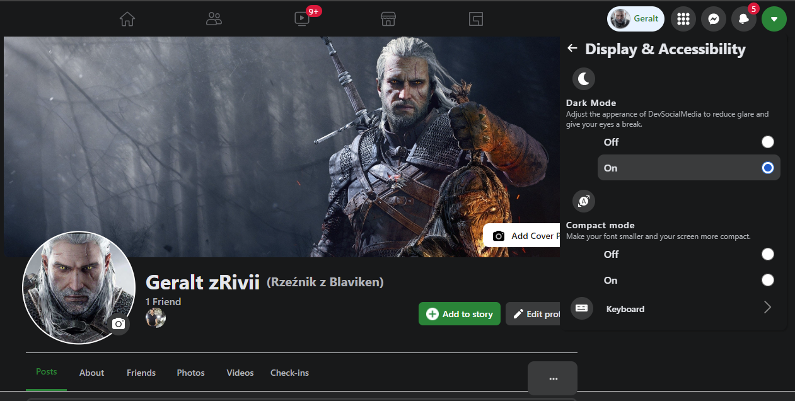
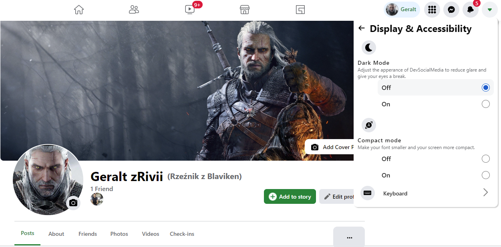
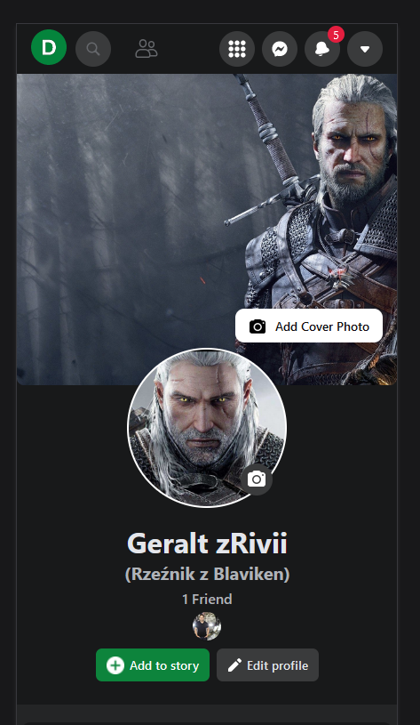

  
## DevSocialMedia - frontend v0.1 beta

## Project currently in progress 👷‍♂️

### Current bugs 🐛🐛:
- home page not fetching posts at first load/click
- huge props drilling, Redux implementation in progress

### The idea and purpose of this project is to make a project which will be a journey not a goal to achieve,  to expose myself for re-factorization, bug-fixes and place to grow to implement other technologies keeping in mind Redux, TypeScript.

## Features:

### - Form validation with formik and Yup - future improvement for react-hook-form as this is much better solution 
  

### - Forgot password which will find your account by email, ask you for confirmation and send reset code for your email to reset password 

### - Create/Delete post with possibility to upload image, add text and emojis from emoji picker  

### - Users can react for posts using hardcoded enums with reacts, can also add comments and comments with images

### - User can upload cover photo or select from already uploaded ones

### - User can upload profile picture photo on left side and crop it based on the need

### - User can add, edit, delete (CRUD) profile details from left side in the profile

### - User can send request for friendship or just follow other profiles

### - Live search with search history - user can search other users by name or surname, search history is saved in user db and can be edited (deleted)

### - Website have two layers, default DARK mode and in options/Display&Accessibility can be changed to LIGHT mode

### - Full responsiveness for couple screen sizes 

### TECHNOLOGY:
- ReactJS
- Redux (redux, react-redux, redux-devtools-extension)
- react-router-dom
- formik -> in future change to react-hook-form as it is much better
- yup - to control validation
- react-responsive - to get mediaQuery hook for responsiveness
- axios
- react-spinners - loading elements
- js-cookie
- emoji-picker-react - cool library for emoji picket
- react-easy-crop - easy to use library for cropping images
- responsive-web-design (RWD) - for couple of sizes
- react-moment
- file-saver
- react-loading-skeleton 💀 - cool loading library

## TODO
- [x] Prepare README
- [ ] ! Repair not loaded posts at first login
- [ ] ! Get rid of props drilling with Redux implementation
- [ ] Redux black box testing
- [ ] Refactor bulky components to as small chunks as possible 
- [ ] Configure Husky pre hooks with eslint prettier and test before commit
- [ ] Refactoring CSS to SCSS and minimizing number of styles
- [ ] Refactoring Frontend to TypeScript
- [ ] Snapshot testing with React-Testing-Library
- [ ] Testing coverage report
- [ ] Add Chat messenger from separated SocketIO api

